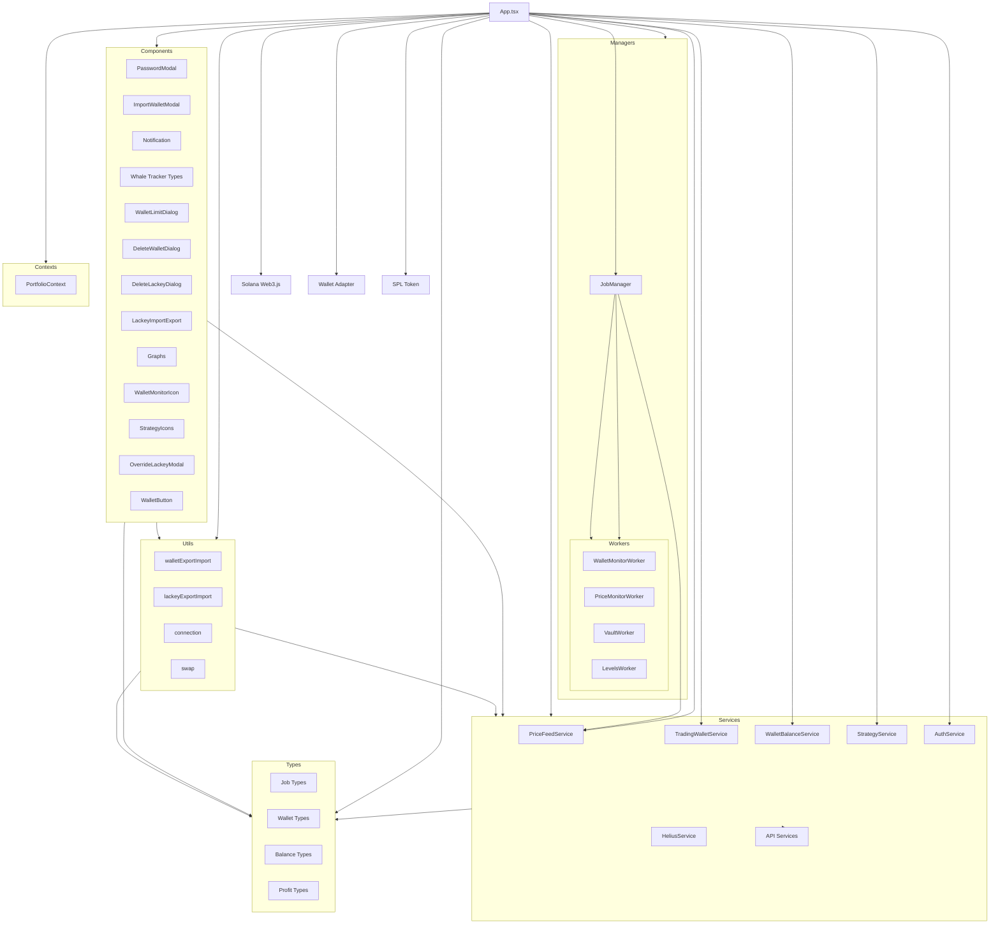

```mermaid
graph TD
    %% Main Application
    App[App.tsx] --> Components
    App --> Services
    App --> Managers
    App --> Utils
    App --> Types
    App --> Contexts

    %% Components
    subgraph Components
        PasswordModal[PasswordModal]
        ImportWalletModal[ImportWalletModal]
        Notification[Notification]
        WhaleTracker[WhaleTracker]
        WalletLimitDialog[WalletLimitDialog]
        DeleteWalletDialog[DeleteWalletDialog]
        DeleteLackeyDialog[DeleteLackeyDialog]
        LackeyImportExport[LackeyImportExport]
        Graphs[Graphs]
        WalletMonitorIcon[WalletMonitorIcon]
        StrategyIcons[StrategyIcons]
        OverrideLackeyModal[OverrideLackeyModal]
        WalletButton[WalletButton]
    end

    %% Services
    subgraph Services
        PriceFeedService[PriceFeedService]
        TradingWalletService[TradingWalletService]
        WalletBalanceService[WalletBalanceService]
        StrategyService[StrategyService]
        AuthService[AuthService]
        HeliusService[HeliusService]
        API[API Services]
    end

    %% Managers
    subgraph Managers
        JobManager[JobManager]
        JobManager --> Workers
    end

    %% Workers
    subgraph Workers
        WalletMonitorWorker[WalletMonitorWorker]
        PriceMonitorWorker[PriceMonitorWorker]
        VaultWorker[VaultWorker]
        LevelsWorker[LevelsWorker]
    end

    %% Utils
    subgraph Utils
        WalletExportImport[walletExportImport]
        LackeyExportImport[lackeyExportImport]
        Connection[connection]
        Swap[swap]
    end

    %% Types
    subgraph Types
        Jobs[Job Types]
        Wallet[Wallet Types]
        Balance[Balance Types]
        Profit[Profit Types]
        WhaleTracker[Whale Tracker Types]
    end

    %% Contexts
    subgraph Contexts
        PortfolioContext[PortfolioContext]
    end

    %% Dependencies
    App --> JobManager
    App --> PriceFeedService
    App --> TradingWalletService
    App --> WalletBalanceService
    App --> StrategyService
    App --> AuthService

    JobManager --> PriceFeedService
    JobManager --> Workers

    Services --> API
    Services --> Types

    Components --> Services
    Components --> Utils
    Components --> Types

    Utils --> Types
    Utils --> Services

    %% External Dependencies
    App --> SolanaWeb3[Solana Web3.js]
    App --> WalletAdapter[Wallet Adapter]
    App --> SPLToken[SPL Token]
``` 